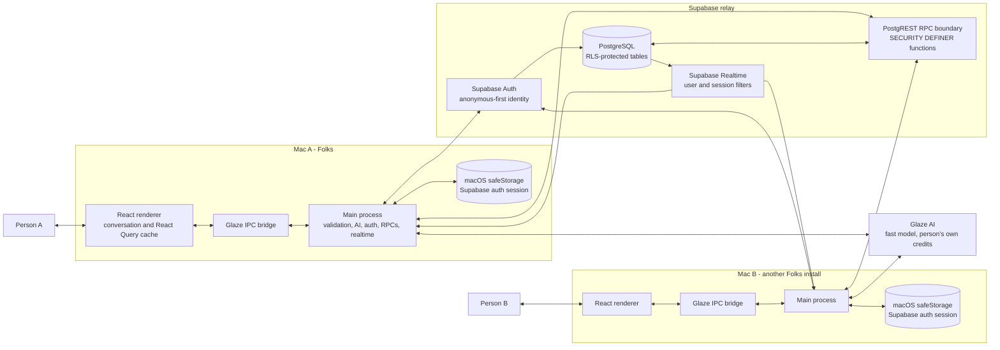
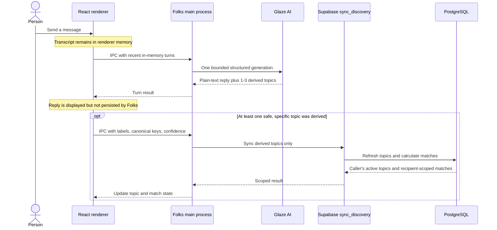
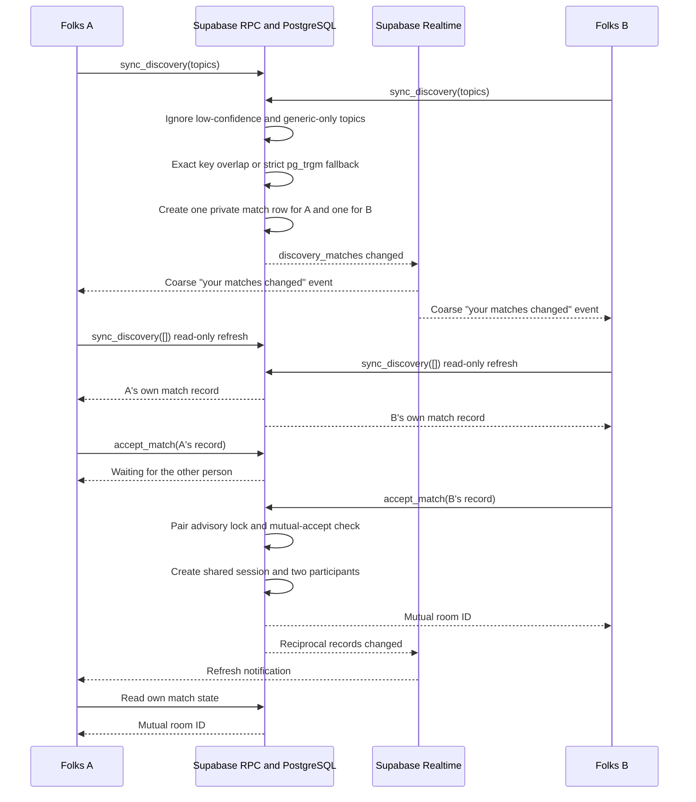
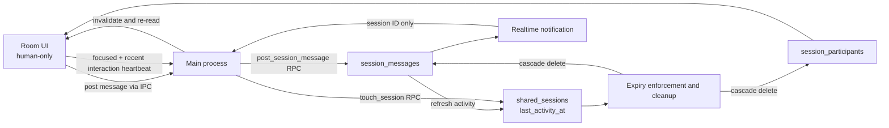

# Folks Architecture

This document describes the architecture used by the current Folks release. It
covers the active ephemeral-discovery path, not the dormant community and
resource-sharing code preserved for future work.

## System Overview



The renderer never talks directly to Supabase. All AI, authentication, database,
and realtime operations cross validated IPC handlers into the main process.
The Supabase publishable key ships with the app; authorization depends on Row
Level Security and the database functions, not on that public key being secret.

## Private AI Turn And Topic Sync



One Glaze AI generation produces both the response and the matching metadata.
The model is instructed not to emit identifying details or sensitive topics.
Topics are currently specific English phrases with canonical lowercase keys.

Folks does not persist the transcript and never sends it to Supabase. The recent
in-memory transcript is, however, processed by Glaze AI to generate the reply
and topics. This document makes no claim about Glaze's own inference retention
or training policies.

## Matching And Mutual Connection



Matching requires at least one non-generic topic with confidence `>= 0.5`.
Canonical keys match exactly first. A conservative trigram fallback applies
only when both keys are at least six characters and similarity is `>= 0.82`.
Blocks are checked in both directions.

Each encounter creates two reciprocal `discovery_matches` rows. Row Level
Security lets a person read only the row addressed to them, so the app cannot
enumerate everyone else's topics or matches. `accept_match` uses a per-pair
database advisory lock so simultaneous acceptance creates one room.

## Temporary Room



The room contains two humans and no AI. Messages and room metadata are stored
in Supabase so the independently installed apps can communicate. They are
protected by TLS and participant-scoped RLS, but they are not end-to-end
encrypted; the backend operator can access database content.

Messages refresh the inactivity clock. A heartbeat refreshes it only while the
window is focused and the person interacted recently. After ten quiet minutes,
room RPCs reject further activity. Where `pg_cron` is available, a cleanup job
runs every five minutes and deletes inactive discovery sessions, cascading to
their participants and messages.

## Realtime Is A Hint, Not The Source Of Truth

Realtime subscriptions are filtered to the authenticated person's match rows
or the active room's messages. A database event causes the main process to send
only a coarse user or session identifier over IPC. The renderer then invalidates
its React Query cache and performs a fresh RLS-scoped read.

This design avoids trusting realtime payloads as application state and prevents
a notification from becoming a path around database authorization.

## Data Boundaries

| Data | Location | Who can read it | Lifetime |
| --- | --- | --- | --- |
| Conversation transcript and AI replies | Renderer memory; recent turns pass through the main process to Glaze AI | The person and Glaze AI during inference | Current window/session; not persisted by Folks |
| Disclosure preference | Device-local preferences | The local app | Until local data is cleared |
| Supabase auth session | macOS `safeStorage` through the main process | The local app | Persists across launches until sign-out or deletion |
| Derived topic labels, keys, and confidence | `discovery_topics` | Owner through RLS; matching RPC during comparison | Ten minutes since the topic was refreshed; best-effort immediate clear on close or quit |
| Recipient-specific match state | `discovery_matches` | Only the record's recipient through RLS | Ten-minute active encounter window |
| Room metadata and participants | `shared_sessions`, `session_participants` | Current participants through RLS | Room becomes inactive after ten quiet minutes, then cleanup removes it |
| Human room messages | `session_messages` | Current participants through RLS; backend operator at the database layer | Deleted with the inactive discovery session |

## Active And Dormant Source

The current UI uses this path:

```text
DiscoveryScreen
  -> Glaze AI turn
  -> topic sync and realtime match notice
  -> mutual accept
  -> RoomView
```

The repository still contains tested foundations for communities, invitations,
presence, handshakes, resource policies, and ledgers. Those modules and tables
are dormant in the current user experience. They are preserved for the
longer-term roadmap and must not be interpreted as shipped resource sharing.

## Key Source Files

- `app/renderer/components/discovery/discovery-screen.tsx`: current conversation,
  topic, and match UI.
- `app/renderer/components/discovery/room-view.tsx`: temporary human room.
- `app/main/handlers/discovery.ts`: validated IPC boundary.
- `app/main/services/discovery-ai.ts`: bounded Glaze AI turn and topic schema.
- `app/main/services/discovery.ts`: Supabase discovery and room adapter.
- `app/main/services/realtime.ts`: filtered realtime subscriptions.
- `app/main/services/supabase-client.ts`: main-process client and encrypted auth
  storage.
- `app/main/db/schema.sql`: tables, RLS policies, matching RPCs, TTLs, and
  cleanup.
