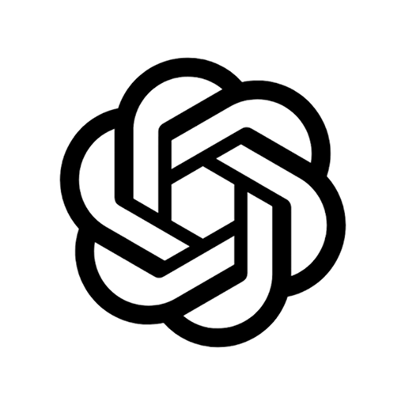

<p align="center">
  
</p>

# Folks

Folks is a Glaze-built macOS app that turns private AI conversation into
ephemeral human discovery.

People can think out loud with AI, notice when someone else is exploring a
similar topic without seeing their conversation, and connect through mutual
consent in a temporary one-to-one room. There are no profiles, feeds, friends
lists, or chat history.

The longer-term vision includes multilingual discovery and, eventually, trusted
communities that can safely share AI capabilities. See
[ROADMAP.md](ROADMAP.md) for direction and [DIAGRAM.md](DIAGRAM.md) for the
current architecture.

## Repository Contents

- `app/`: Glaze-generated Folks macOS application source.
- `ROADMAP.md`: public product direction, priorities, and future explorations.
- `DIAGRAM.md`: current process, data-flow, privacy, matching, and room architecture.
- `outputs/folks-prd.md`: full product, privacy, interaction, competition, and acceptance specification.
- `outputs/glaze-plan-prompt.md`: paste-ready Glaze Plan-mode and Build-mode prompts.
- `outputs/visual-prototype/`: interactive browser prototype with three switchable visual directions.
- `supabase/`: hosted relay schema, migrations, configuration, and email templates.
- `work/validate-prototype.cjs`: Playwright validation for layouts and the simulated interaction path.

## Prototype

```bash
cd outputs/visual-prototype
npm install
npm run prototype
```

Open `http://127.0.0.1:4173/?variant=A`.

## Glaze App

The native source in `app/` is a snapshot of Glaze project commit `ca16c4c`.
Open it through Glaze to build or run it; its scripts resolve the CLI from
Glaze's managed SDK layout and are not standalone npm build commands.

Glaze remains the live project and GitHub is its shallow mirror. After Glaze
changes the app, sync the source, commit, and push it with:

```bash
bun sync
```

Use `bun sync --dry-run` to preview the sync without writing or
`bun sync --no-push` to create the commit without pushing it. The command stops
if the GitHub worktree is dirty, stages only `app/`, and excludes Glaze's local
MCP configuration, generated dependencies, memory, icons, and logs.

## Powered By

<table>
  <tr>
    <td width="64" align="center" valign="middle">
      <a href="https://www.glaze.app/">
        
      </a>
    </td>
    <td>
      <strong><a href="https://www.glaze.app/">Glaze</a></strong><br>
      Native macOS runtime, user-authorized AI, and app building, packaging, and
      publishing.
    </td>
  </tr>
  <tr>
    <td width="64" align="center" valign="middle">
      <a href="https://supabase.com/">
        
      </a>
    </td>
    <td>
      <strong><a href="https://supabase.com/">Supabase</a></strong><br>
      Anonymous-first authentication, PostgreSQL, Row Level Security, Realtime
      events, topic matching, temporary rooms, and expiry cleanup.
    </td>
  </tr>
  <tr>
    <td width="64" align="center" valign="middle">
      <a href="https://resend.com/">
        
      </a>
    </td>
    <td>
      <strong><a href="https://resend.com/">Resend</a></strong><br>
      SMTP delivery for Supabase Auth emails that let users protect and recover
      their identity.
    </td>
  </tr>
</table>

The app is written in React and TypeScript. Its supporting technology includes
TanStack Query and Router, Tailwind CSS, PostgreSQL `pg_trgm` and `pg_cron`, and
the macOS Keychain through Glaze's encrypted storage API.

## Made By

Folks was created and built by **[Caio Lins](https://clins.me)** using Glaze and
ChatGPT as tools.

<table>
  <tr>
    <td width="64" align="center" valign="middle">
      <a href="https://clins.me">
        
      </a>
    </td>
    <td>
      <strong><a href="https://clins.me">Caio Lins</a></strong><br>
      Creator and sole builder: product direction, implementation, testing, and
      release.
    </td>
  </tr>
  <tr>
    <td width="64" align="center" valign="middle">
      <a href="https://www.glaze.app/">
        
      </a>
    </td>
    <td>
      <strong><a href="https://www.glaze.app/">Glaze</a></strong><br>
      AI development tool used to generate, build, run, package, and publish the
      native macOS app.
    </td>
  </tr>
  <tr>
    <td width="64" align="center" valign="middle">
      <a href="https://chatgpt.com/">
        
      </a>
    </td>
    <td>
      <strong><a href="https://chatgpt.com/">ChatGPT</a>
      (<code>GPT 5.6 Sol</code>)</strong><br>
      AI tool used for product specification, architecture and security review,
      prototyping, implementation support, validation, and release coordination.
    </td>
  </tr>
</table>

## License

Folks source code and documentation are licensed under the
[Apache License 2.0](LICENSE). Branding, screenshots, personal imagery, and
third-party marks are excluded; see [NOTICE](NOTICE).

## Status

The current build includes private Glaze AI conversation, English topic
derivation, global realtime matching, mutual consent, temporary human rooms,
anonymous-first identity, ten-minute inactivity expiry, and an in-app roadmap.

Production Supabase infrastructure is configured. The database suite, Glaze
build checks, real AI turn, and external two-user match-to-room flow have been
verified. Earlier community, visual-world, and Hermes work remains preserved as
research and dormant source rather than part of the first release.
