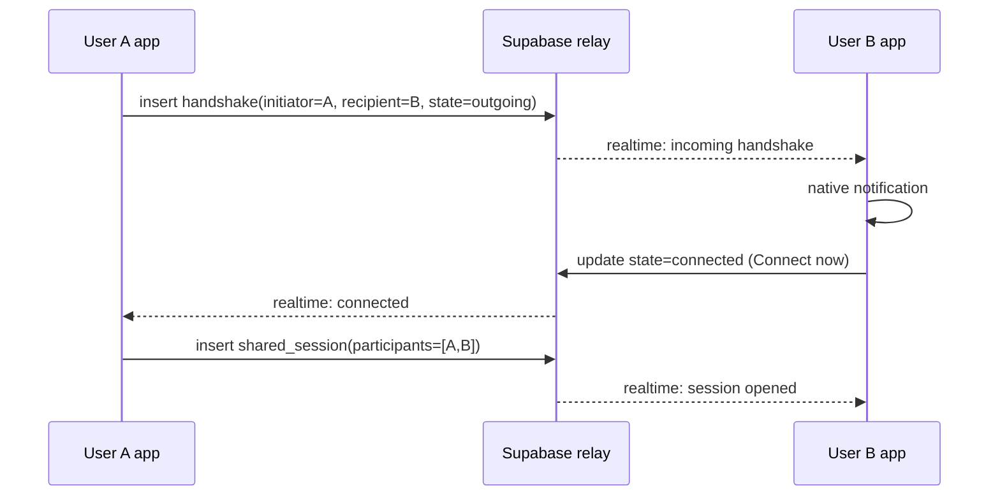
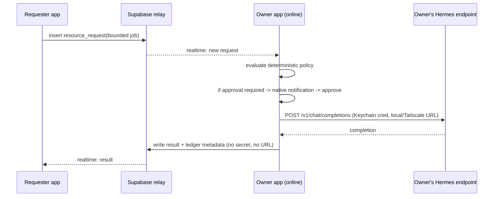

# Folks — Glaze Implementation Plan

## Context

Folks is a local-first macOS app (Glaze Awards submission) that turns private AI use into a path to human connection and trusted resource sharing. The vertical slice must prove ONE memorable loop across **two independently-installed copies (two real users)**:

> Private AI chat → choose Selective mode and share one approved signal → notice a real nearby presence (no transcript exposed) → mutual handshake → shared text session with Human-only / Quiet-notes / On-demand AI → one member requests a bounded task from another member's owner-controlled Hermes resource → deterministic policy allows/denies → transparent ledger entry (no money).

Source of truth: `folks-prd.md` + the four screenshots. Visual direction is **settled**: one app rendered as **Living Orbit** (full-window immersive world), borrowing **Mission Control's inspector** for resource/policy/ledger detail and **Quiet Field's restraint** for private/onboarding states. Do not build three products or a card dashboard.

### Decisions made with the user
- **Transport:** Supabase Realtime (hosted). Publishable anon key + URL baked into the app, protected by Row-Level Security. Backend holds the WebSocket connection; renderer talks over IPC.
- **Hermes:** AI-guided setup from complete beginner to advanced (home server / Tailscale / LM Studio / Ollama / Hermes Agent). Build the real routing + policy + real `POST /v1/chat/completions`; when no endpoint is configured, return a clearly-labeled local **fixture** for the result only (never portrayed as a real agent call).
- **Voice:** Text-only for P0. Realtime voice (bring-your-own OpenAI Realtime / ElevenLabs key, optional LiveKit) is a P1 capability wired through the shared contract — not in the competition build.
- **Companion name:** **North** (established in the prototype screenshots). **Hermes** = the community-owned resource a member contributes.

---

## 1. Feasibility verdict

**Feasible with constraints.** Hard constraints (all honest, surfaced in-app):

1. **External relay required.** Glaze exposes no hosted relay, realtime DB, sync, or account identity. Real two-user features run through Supabase (outbound WSS from the Node backend). The backend *can* make arbitrary outbound HTTPS + hold a WebSocket while the app is open.
2. **No background-while-quit.** No daemon runs when the app is fully quit. → **"Owner must be online with Folks open"** is an explicit P0 constraint for Hermes requests (fallback ladder #3). Contributor app may run headless via `activationPolicy: "accessory"` + login item, but the process must be alive.
3. **No SDK speech-to-text and no embeddings API.** → Text-only conversation P0. Semantic matching uses coarse, locally-derived topic tags (not vector similarity).
4. **Open-mode semantic matching is coarse.** **Selective is the hero real path** (matches the storyboard's "safe community AI" signal). Open mode ships as real coarse-tag derivation if time allows, otherwise labeled **Preview** — privacy is never weakened (fallback ladder #2).
5. **Two-Mac E2E is manual.** Live inspection can drive only one instance; the two-user path is verified by the user across two Macs/accounts.

Nothing in the required loop is blocked.

---

## 2. Capability matrix

| Capability | Source | Implementation | Data leaving the Mac | Fallback |
|---|---|---|---|---|
| Identity | External (Supabase) | Supabase **anonymous auth** → stable `auth.uid()` per install; signing key + profile local | app user id, approved public profile fields | Local-only identity; no discovery |
| Real-time presence | External (Supabase Realtime) | Backend subscribes to presence/signals; matches by community + Selective signal overlap | anonymous presence id, availability, coarse signal category | Empty world honestly ("no matches") |
| Shared chat | External (Supabase) | `session_messages` table + realtime; TLS in transit | messages the user deliberately sends | Human-only still works; offline banner |
| Notifications | Glaze `@glaze/core/backend#Notification` | Incoming handshake / approval request | none | In-app badge |
| Glaze AI (North) | Glaze `@glaze/core/ai` | `streamText`/`generateText` via `glaze("fast"\|"smart")`; `useGlazeAI` in renderer | prompt → Glaze proxy (each user's own credits) | Human/community features fully work without AI |
| Speech | Unavailable in SDK | — | — | Text only (P1: BYO OpenAI Realtime/ElevenLabs key) |
| Keychain | Glaze `@glaze/core/backend#safeStorage` | Hermes URL+key, identity signing key → encrypted `.bin` in `userData` | none | Feature disabled if encryption unavailable |
| Local Hermes call | Node backend (owner's app) | `POST /v1/chat/completions` to owner's local/Tailscale endpoint | none to relay; owner→owner's endpoint only | Labeled local fixture result |
| Cross-device job relay | External (Supabase) | Requester writes bounded job row → owner app (subscribed) executes → writes result | bounded job envelope + minimal ledger metadata | "Owner offline — resource unavailable" |

---

## 3. System architecture

**Glaze app modules** (all local unless noted):
- **Personal Companion (North)** — private streaming chat; drafts policies & Hermes setup guidance. `main/services/companion.ts`.
- **Community Relay Adapter** — the one network boundary. Supabase client + realtime subscriptions, streamed to renderer over IPC. `main/services/relay.ts`.
- **Identity** — anonymous auth, stable app id, public profile. `main/services/identity.ts`.
- **Presence & Matching** — publish/clear per mode; read matches. `main/services/presence.ts`.
- **Handshake Coordinator** — full state machine, expiry, cooldown, rate limit, block. `main/services/handshake.ts`.
- **Shared Session** — messages, session AI mode, retention. `main/services/session.ts`.
- **Consent Policy Engine** — deterministic structured rules; AI only drafts, never enforces. `main/services/policy.ts`.
- **Resource Router** — register resource, evaluate policy, request approval, call Hermes, write ledger. `main/services/resource-router.ts` + `main/services/hermes.ts`.
- **Contribution Ledger** — usage entries, no settlement. `main/services/ledger.ts`.
- **Secrets** — `safeStorage`. `main/services/secrets.ts`. **Local Persistence** — JSON in `userData`. `main/services/storage.ts`.
- **Capability Contract** — unified provider registry (extension boundary). `main/services/capabilities/contract.ts`.
- **World Renderer** — Living Orbit canvas + panels (renderer).

**Trust boundaries & secrets:** Hermes URL/key, private transcripts, personal AI memory, structured policy source, block list, full ledger detail → **local only** (Keychain/`userData`). Relay receives only: app user id, approved profile fields, presence mode, coarse match representation, approved Selective signals, handshake state, shared-session messages, community membership, bounded resource-request envelope, minimal ledger metadata. **Never** transcripts, memory, keys, or Hermes credentials.

**Transport & auth:** WSS/HTTPS to Supabase; Supabase anonymous JWT; RLS on every table so a user reads only their own rows, their handshakes, their sessions, and their communities' shared data. Server-verified membership/ownership — never trust client-supplied role claims.

**Handshake sequence:**

**Permitted Hermes request:**

---

## 4. Privacy proof

**Data inventory by mode:**
- **Private:** nothing published — no presence row, no heartbeat, no signal, no semantic representation. User is undiscoverable.
- **Selective:** only the user-approved signal text + a coarse category + scope/expiry. Underlying conversation never sent.
- **Open (if shipped real):** up to N coarse topic tags derived locally via Glaze AI, short TTL, deleted immediately on Open→Private. No prompts, transcripts, responses, files, names, or topic labels. Otherwise labeled **Preview**.

**Retention/deletion:** Open representation TTL'd; handshakes expire; shared-session retention visible/configurable; resource-request payloads deleted after completion unless policy permits; "Delete local data" wipes local store; logs never contain secrets or transcript text.

**Why the relay/another user cannot reconstruct a conversation:** the relay only ever receives data the user explicitly approved (a Selective signal, a deliberately-sent shared message) or a coarse TTL'd tag set. Transcripts, prompts, memory, and keys are never transmitted, so there is no stored material to reconstruct from.

---

## 5. Data model & state machines

**Supabase tables (RLS on all):** `users`, `communities`, `memberships`, `signals`, `presence`, `handshakes`, `shared_sessions`, `session_messages`, `resources`, `resource_requests`, `ledger_entries`.
**Local-only (userData/Keychain):** private transcripts + North memory, structured policies + NL source, Hermes credential, block list, worldview/preferences, full ledger detail.

Entity fields follow the PRD (UserProfile, PresencePolicy, Signal, Presence, Handshake, SharedSession, Community, ResourceNode, ResourceRequest, LedgerEntry, Worldview).

**Handshake states:** `idle → outgoing/incoming → connected | nearby | deferred(cooldown) | declined | blocked | expired(timeout)`. Rules: no transcript ever auto-attached; optional reviewed intro; per-sender/recipient rate limits; decline/block need no reason; block survives restart.

**Resource request states:** `submitted → policy_evaluated → (auto_allowed | needs_approval → approved | denied | capped) → executing → completed | failed | canceled(revoked)`. Revocation blocks new work and cancels queued work when safe.

**Policy (deterministic JSON):** allowed communities/members/roles, allowed & disallowed tool categories, per-request token/duration/cost cap, per-member and community limits, availability hours, owner reserve, approval thresholds, allowed input data classes, result-retention flag, pause/revoke. AI may draft; owner reviews structured fields before activation; enforcement is pure code.

---

## 6. Screen & interaction map

- **Living Orbit (main):** full-window dark field (`#111315`), North as central sphere, real/Preview presences as planetary bodies, distance = relevance; top bar with Folks mark, Private/Selective/Open segmented control, Preview-world toggle, sound + settings; conversation composer reachable without covering the world.
- **Private companion (North):** Quiet Field restraint; streaming text.
- **Presence inspector + handshake:** focused side panel/sheet — Connect now / Stay nearby / Not now / Decline; mute; block.
- **Shared session:** message thread + Human only / Quiet notes / On demand switch; recording/AI/retention indicators; leave/report/block.
- **Community resource & policy inspector (Mission Control):** resource card, structured policy fields, approval prompts, health/availability.
- **Contribution ledger:** contributor, requester, resource, times, usage, estimated cost + confidence, local-vs-paid, decision, outcome. No money.
- **Onboarding & Hermes setup wizard:** North-guided, beginner→advanced; can emit a copy-paste setup prompt for the user's own agent, test the endpoint, and translate NL rules into a reviewable policy.
- **Settings / privacy / permissions / degraded states:** privacy modes, mic (P1), delete-local-data, revoke, keys, and honest AI-denied / credits-exhausted / offline / resource-unavailable / disconnected / empty-world states.
- **Accessibility:** list view mirroring world state; reduced-motion honored; full keyboard nav.

Palette: near-black `#111315`, warm white `#F5F1E8`, mineral teal `#3AAFA1`, coral `#F26B5E`, saffron `#E5B94B`, moss `#789262`, cool gray `#A7ADB4`. Native sans for UI; restrained display face for brand only; no viewport-scaled fonts; zero letter-spacing. Sparse sound cues, master toggle, reduced-motion respected.

---

## 7. Phased build

**Window:** framed main window, `backgroundColor: "#111315"`, hidden/inset traffic lights with a custom draggable top bar, generous default (~1360×880) — finalize via `glaze-window-sizing`. Opaque cosmic canvas (no vibrancy/CSS blur). Canvas/SVG orbit with `requestAnimationFrame`, gated by `prefers-reduced-motion`.

**Phase 0 — Spikes (riskiest first).** Supabase anonymous auth + realtime round-trip between two installs; Glaze AI streaming; `safeStorage`; a real `POST /v1/chat/completions` to a local endpoint. *Accept:* two installs exchange a realtime row; North streams; a secret survives restart; a live completion returns. *Fallback:* labeled fixture for Hermes.
**Phase 1 — Shell + world + local + North.** Living Orbit, local persistence, private streaming companion, privacy segmented control, Preview world. *Accept:* private chat streams; Private mode emits nothing (verified); Preview clearly labeled. *Rollback:* keep companion + world only.
**Phase 2 — Identity, presence, handshake, shared text.** Anonymous identity, Selective signal publish + preview, matching, handshake state machine + notifications, shared session + modes. *Accept:* two real users complete Selective→presence→handshake→shared text; Human-only works with AI denied. *Fallback:* Open→Preview.
**Phase 3 — Community, Hermes, policy, ledger.** One community, resource registration + AI-guided setup wizard, deterministic policy, resource router + real Hermes call, ledger. *Accept:* one permitted + one denied request behave correctly; credential stays in Keychain; ledger entry created without secrets. *Fallback:* labeled fixture result; "owner must be online."
**Phase 4 — Polish, a11y, Store assets, demo mode.** Reduced motion, keyboard nav, list view, degraded-state copy, 16:9 screenshots, Preview demo. *Accept:* full readiness gate passes.

Capability contract lands in Phase 1 and both providers (Glaze-native text, community Hermes) implement it, so voice/image/OAuth/local-model providers slot in later without rewriting companion, router, policy, or ledger.

---

## 8. Test plan

- **Unit (deterministic):** policy engine (allow/deny/cap/approval, limits, hours, revoke); handshake transitions (legal, out-of-order, expiry, cooldown, block); resource-request transitions.
- **Two-Mac E2E (manual, user-run):** match+handshake+chat; contribute Hermes + one permitted request; owner denies; credit exhaustion with chat continuing; Open→Private disappearance; block survives restart.
- **Privacy:** confirm Private emits no rows/heartbeat; shared messages carry no transcript of private chat; relay payloads contain no secrets.
- **AI:** permission-denied and `insufficient-credits`/`daily-limit-reached` handled per `GlazeAIError` state; non-AI features keep working.
- **Secrets:** Hermes cred only in Keychain; absent from logs and relay.
- **Accessibility:** reduced-motion, keyboard nav, list view mirrors world.

---

## 9. Competition delivery

- **60-sec demo:** 0–8s private North chat → 8–15s Selective "safe community AI" preview/confirm → 15–23s presence drifts closer → 23–31s handshake accepted → 31–39s Human-only then "bring North in on demand" → 39–52s bounded Hermes task streams back → 52–58s ledger → 58–60s brand card.
- **Screenshots:** 6, 16:9, matching PRD Store order; Living Orbit first.
- **Disclosure:** names Supabase relay + exactly what it stores (ids, approved signals, handshake state, shared messages, bounded job envelopes, minimal ledger metadata); states each user spends their own Glaze credits; Hermes credential stays in Keychain; Preview clearly labeled.
- **Checklist = the readiness gate** in §Verification.

---

## Critical files

- `package.json` — add `@supabase/supabase-js`; declare `glaze.capabilities.ai` (`grades: ["fast","smart"]`, honest `purpose`, `mode: "optional"`).
- `main/index.ts` — window + lifecycle. `renderer/preload.ts` — expose app IPC + `systemPreferences`/`Notification` wiring as needed.
- `main/services/{relay,identity,presence,handshake,session,companion,policy,resource-router,hermes,ledger,secrets,storage}.ts` and `main/services/capabilities/contract.ts`.
- `main/handlers/*.ts` — IPC surface. Supabase schema + RLS: `main/db/schema.sql` (applied once to the Supabase project).
- `renderer/main/{home-view,router}.tsx`; `renderer/components/{orbit,companion,presence,session,resource,onboarding,settings}/*`.

Reuse Glaze SDK: `@glaze/core/ai` (`glaze`, `generateText`, `streamText`), `@glaze/core/hooks#useGlazeAI`, `@glaze/core/backend#{safeStorage,Notification,systemPreferences,app}`, `BrowserWindow`. Invoke skills at build time: `glaze-ai`, `glaze-window-sizing`, `glaze-browser-window-recipes`, `glaze-component-patterns`, `glaze-external-api`, `glaze-data-storage`, `glaze-ipc-communication`, `glaze-native-permissions`, `glaze-theming`.

---

## Verification (readiness gate)

Build succeeds with no unresolved Glaze errors; `npm run type-check && npm run lint` clean. Then confirm end-to-end (two Macs where noted):
1. Two real users complete Selective signal → presence → handshake → shared text.
2. Human-only chat works with Glaze AI denied.
3. Private mode shows no network leakage of conversation content.
4. One permitted and one denied Hermes request behave correctly.
5. Hermes secret remains only in the owner's Keychain.
6. AI denial, exhausted credits, denied mic, offline relay, unavailable owner, revocation, blocking, deletion all have functional states.
7. Reduced motion and keyboard navigation work; list view mirrors the world.
8. Preview presences unmistakably labeled; never mixed with live.
9. Store screenshots are 16:9 and tell the 60-second story.

---

## Honest limitations (stated in-app and in submission)

1. Requires the Supabase relay (free tier; publishable anon key baked in).
2. Hermes requests require the **owner online with Folks open** (no background-while-quit).
3. **Text-only** conversation in P0; realtime voice is P1 (bring-your-own key).
4. **Selective** is the real hero matching path; **Open** ships real-coarse or labeled **Preview** — privacy never weakened.
5. No embeddings API → coarse tag matching, not vector similarity.
6. Two-user flows verified manually across two Macs.
